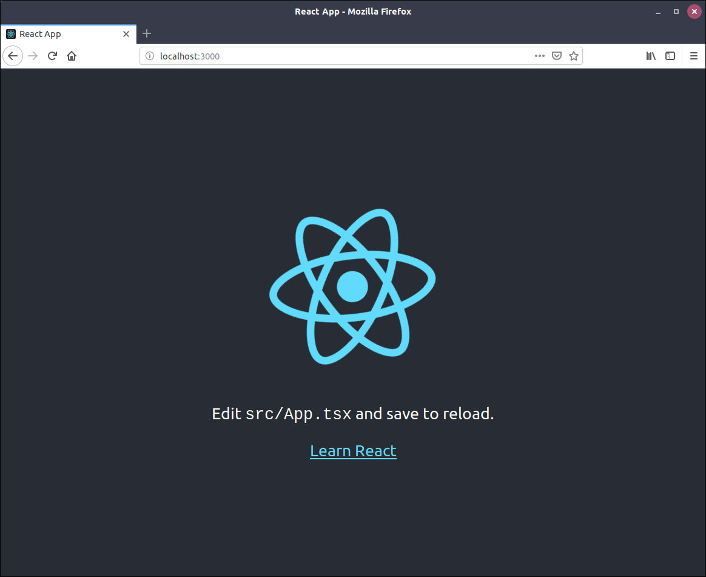
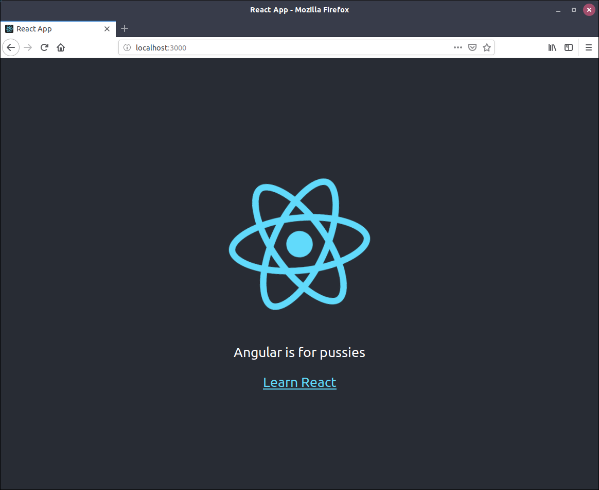

# Installation

Pendant le projet, on va tous bosser dans une VM où tout est déjà installé, mais je pense que c'est important pour tout le monde de savoir comment on installe pour savoir comment ça marche.

Du coup pour ceux qui liraient ce document et qui ne sont pas sous Linux, je vous conseille de l'installer parce que c'est cool, ou bien de faire une VM Linux, et si possible sur Ubuntu ou Debian, parce que je vais me baser sur ça pour écrire la suite.

## Installer NodeJS

À la base, NodeJS est un logiciel qui a été créé pour exécuter du JavaScript coté serveur, mais il est aussi utile pour le développement d'application frontend, principalement parce que NodeJS nous fournit NPM.  Déjà, NPM est un acronyme pour Node Packages Manager. Et un acronyme c'est une abréviation pour... non je déconne !

NPM c'est donc un gestionnaire de paquets pour JavaScript. Il a été créé pour NodeJS mais il est utilisable pour n'importe quel projet qui utilise du JavaScript. Mais au delà d'un gestionnaire de paquets, c'est aussi un utilitaire qui permet de facilement exécuter certaine commandes bien utiles pour le développement, les tests, etc.

Maintenant que tout ça est dit, on peut commencer l'installation. Ouvrez un terminal, et lancez les commandes suivantes :

```bash
$ curl -sL https://deb.nodesource.com/setup_11.x | sudo -E bash -
$ sudo apt-get install -y nodejs
```

Ensuite, grâce à NPM, on va installer un petit utilitaire qui va nous créer un projet React déjà prêt ! Pour ça, lancez la commande

```bash
$ npm install --global create-react-app
```

Décortiquons un peu cette commande. `npm install` c'est pour demander à NPM d'installer quelque chose, `--global` c'est pour dire à NPM qu'on veut installer le paquet en global sur notre machine, et pas dans un projet spécifique. `create-react-app` c'est le paquet que l'on veut installer. C'est un utilitaire fournit par Facebook, qui permet en une commande de créer un projet React avec déjà certaines dépendances installées et configurées pour que ça puisse marcher directement. On va détailler aplus tard quelques paquets importants qui sont installés. Mais pour le moment, créons notre projet !

```bash
$ create-react-app react-tutorial --typescript
```

Si tout s'est bien passé, cette commande a du vous générer un dossier ayant cette tête là :

```bash
├── node_modules
│   ├── ...
├── package.json
├── package-lock.json
├── public
│   ├── favicon.ico
│   ├── index.html
│   └── manifest.json
├── README.md
├── src
│   ├── App.css
│   ├── App.test.tsx
│   ├── App.tsx
│   ├── index.css
│   ├── index.tsx
│   ├── logo.svg
│   ├── react-app-env.d.ts
│   └── serviceWorker.ts
└── tsconfig.json

```

Ça fait pas mal de fichiers, mais je vais expliquer à quoi ils servent.

## Structure du projet

On va commencer par le plus important, le fichier `package.json`. C'est un fichier hyper important, puisque c'est ce fichier qui sert à décrire le projet. On va donc l'ouvrir pour voir un peu tout ce qu'il y a dedans.

```json
{
  "name": "react-tutorial",
  "version": "0.1.0",
  "private": true,
  "dependencies": {
    "@types/jest": "23.3.12",
    "@types/node": "10.12.18",
    "@types/react": "16.7.18",
    "@types/react-dom": "16.0.11",
    "react": "^16.7.0",
    "react-dom": "^16.7.0",
    "react-scripts": "2.1.3",
    "typescript": "3.2.2"
  },
  "scripts": {
    "start": "react-scripts start",
    "build": "react-scripts build",
    "test": "react-scripts test",
    "eject": "react-scripts eject"
  },
  "eslintConfig": {
    "extends": "react-app"
  },
  "browserslist": [
    ">0.2%",
    "not dead",
    "not ie <= 11",
    "not op_mini all"
  ]
}
```

Du coup si on regarde le contenu du fichier, on voit qu'il y a des champs `name`, `version`, et `private`. Ces champs sont pas vraiment importants, parce qu'ils serviront uniquement si on veut distribuer notre projet dans NPM.
En revanche, les champs suivants sont beaucoup plus intéressants !

### Dépendances

Le champs `dependencies` est le champs qui va décrire tous les paquets NPM dont dépend le bon fonctionnement de notre application. On a donc les paquets `react` et `react-dom` qui sont des paquets essentiels à n'importe quelle application développé avec React. `react` contient tous les objets et toutes les fonctions nécessaires à la création de composants React, tandis qui `react-dom` contient tout le nécessaire pour lier des composants React au DOM du navigateur *(le DOM c'est une espèce d'interface qui permet d'avoir accès et de modifier le contenu HTML d'une page web)* .
Le paquet `react-scripts-ts` contient un ensemble de scripts, qui ne vont pas nous servir dans le code de notre application, mais qui par contre, nous sont bien utiles pour la mise en place des environnements de développement et de production. J'explique juste après.

### Scripts

Le champs `scripts` décrit différents alias pour formaliser l'appel à des scripts utilitaires pour une application. En fait, tous les alias que l'on met dans le champs `scripts` sont appelables simplement par la commande

```bash
$ npm run <nom_du_script>
```

 Par exemple, si on exécute la commande 

```bash 
 $ npm run start
```

Ça appellera en fait la commande `react-scripts-ts start`. Déjà parce que c'est plus simple à se rappeler, mais aussi parce que c'est une norme que tout le monde adopte. Ça veut donc dire que peut importe que vous soyez développeur, ops, ou testeur, si vous devez lancer une application qui utilise `npm`, peu importe la manière dont elle a été faite et les librairies qu'elle utilise, vous savez que vous la lancerez toujours avec ```npm run start```.

> Mais du coup `react-scripts-ts start` ça fait quoi ?

`react-scripts-ts start` va lancer plein de trucs, mais ce qui nous intéresse le plus, c'est que ça va lancer un faux serveur web, qui fournira l'application à l'adresse `http://localhost:3000`, et que ce serveur va recharger l'application et la page web à chaque modification du code. On va faire un petit test. Lancez la commande 

```bash
$ npm run start
```

Ça peut prendre un peu de temps, mais ça devrait ouvrir votre navigateur ou un nouvel onglet avec le contenu de l'application dedans. Si ça n'ouvre pas le navigateur ou l'onglet automatiquement (ça peut arriver), vous pouvez accéder à la page avec l'URL `http://localhost:3000`.



Vous pouvez donc voir la page d'accueil générée par la `create-react-app`. Pour faire notre petit test, on va juste modifier une ligne d'un fichier pour voir la modification en direct.

Avec votre éditeur préféré *(je vous conseille vraiment Visual Studio Code)*, ouvrez le fichier `src/App.tsx`. Vous devriez y trouver ceci 

```tsx
import React, { Component } from 'react';
import logo from './logo.svg';
import './App.css';

class App extends Component {
  public render() {
    return (
      <div className='App'>
        <header className='App-header'>
          
          <p>
            Edit <code>src/App.tsx</code> and save to reload.
          </p>
          <a
            className='App-link'
            href='https://reactjs.org'
            target='_blank'
            rel='noopener noreferrer'
          >
            Learn React
          </a>
        </header>
      </div>
    );
  }
}

export default App;
```

On décortiquera ce fichier plus tard, pour l'instant modifier simplement la ligne 12 et la remplacer par 

```
Angular is for pussies
```



Maintenant que vous voyez à peu près comment ça marche, on va pouvoir commencer à coder un peu.

